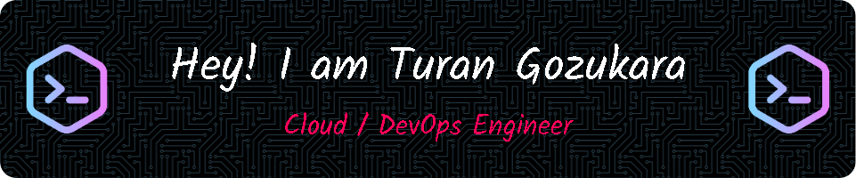

  

###

<h4 align="center">Hello there !   I'm Turan, a Cloud & DevOps engineer focusing on Cloud & Devops architecture.   I have a strong knowledge of Cloud & DevOps as a professional equipped with the trainings I have received from various educational institutions and universities.  Problem-solving, a solution-oriented approach, and my passion for continuous learning consistently enable me to enhance my skills and explore new opportunities.   With my collaborative and communication skills, I strive to be a valuable team player that contributes to every project.</h4>

###

<h2 align="center">Skills 🚀</h2>

###

  
  
  
  
  
  
  
  
  
  
  
  
  
  
  
  
  
  
  
  
  
  
  
  
  
  
  
  
  
  
  
  
  
  
  
  
  
  
  
  
  
  
  

###

<h2 align="center">Social</h2>

###

  

